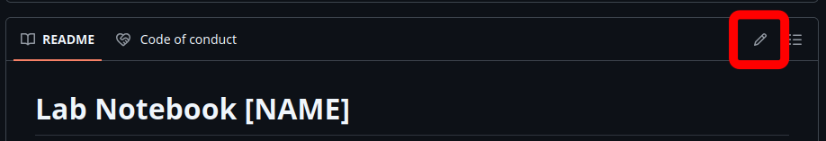

A lab notebook is essential for keeping track of research activities and to ensure reproducibility. 
It provides context and motivation behind research data and can be considered as the foundation of downstream research results.
Therefore, keeping an up-to-date lab notebook is one of the primary responsibilities of a researcher. 

In the Zdouc Lab, we are using private repositories in our GitHub Organization page as storage locations for the lab notebooks of our individual lab members. 
Since GitHub repositories are version-controlled, all changes are tracked, and later modifications can be easily identified.
Therefore, GitHub repositories are an efficient and pragmatic way of keeping an immutable, digital lab notebook.

### How to set up a lab notebook

*Nota bene: these instructions assume that you are already a member of the [ZdoucLab GitHub Organization](https://github.com/zdouc-lab)*

These step-by-step instructions will help you to set up a lab notebook repository in the Zdouc Lab GitHub Organisation:

- In the [ZdoucLab Repositories](https://github.com/orgs/zdouc-lab/repositories), click on `New Repository`
- Keep `zdouc-lab` as the `Owner`. Name the repository with the first three letters of your first name, the first three letters of your last name, and the current year (such as `labbook-MitZdo26`)
- Set the visibility to `Private`
- Under `Start with a template`, choose `zdouc-lab/labbook-template`
- `Include all branches` should be set to `off`
- Click on `Create repository`. After a few seconds, you will be redirected to your new lab notebook repository.

### How to use your lab notebook

You can edit all files on the GitHub page by clicking the edit icon indicated in Figure 1.
You can also easily create new files, if needed. 
All files are in `Markdown` (`.md`), which allows formatting with a simple syntax (described [here](https://docs.github.com/en/get-started/writing-on-github/getting-started-with-writing-and-formatting-on-github/basic-writing-and-formatting-syntax))

Figure 1: The edit-button allow to modify files on the GitHub webpage.

#### Guidelines

- Fill in your details in the placeholders of the `README` file (e.g. `[NAME]`).
- Make it a habit to write down everything - meetings, to-do-lists, tasks, projects.
- Keep to the established files
  - `Daily_notes.md` for everything done on a day (even if only glassware was cleaned)
  - `Meeting_notes.md` for transcripts of discussions with supervisor
  - `Priorities.md` for a running list of to-do's
- the `img` folder should contain any images that are uploaded. Images can be embedded into the Markdown files using HTML

You and your supervisor will regularly check if your lab notebook is up-to-date.
The quality and up-to-dateness of your lab notebook will also be taken into account in your evaluation.
